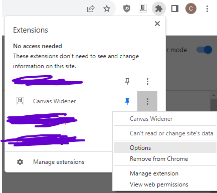
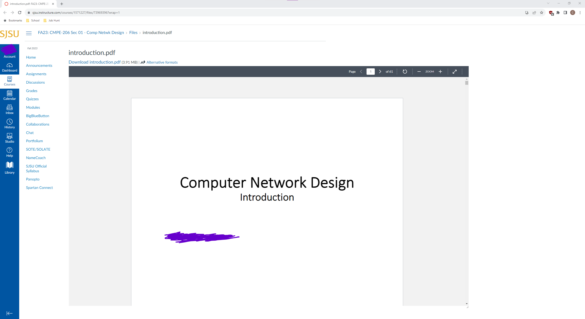

# Canvas Widener
A simple extension to automatically resize canvas file windows so that they stop cutting off the right edge of slides.

##Usage
Install, then try to look at some slides. The width can be changed to any normal CSS value in the extension options, accessed via the three-dot menu as shown:

An example of how it looks with the default setting on a 1440p display:
